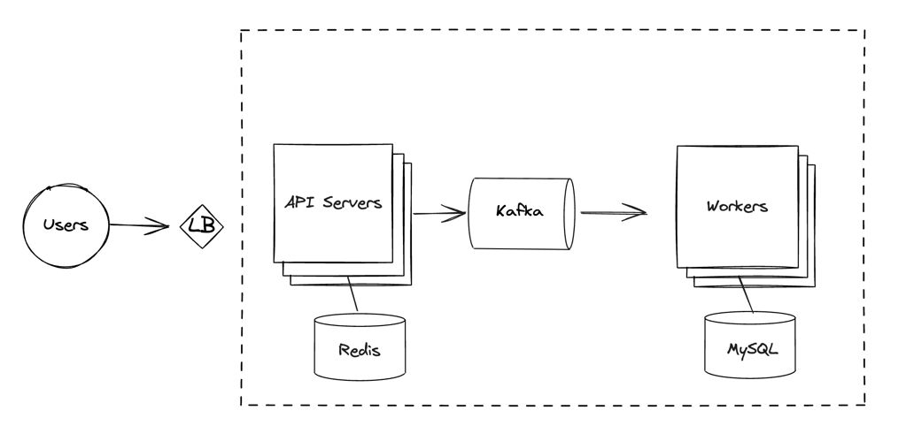
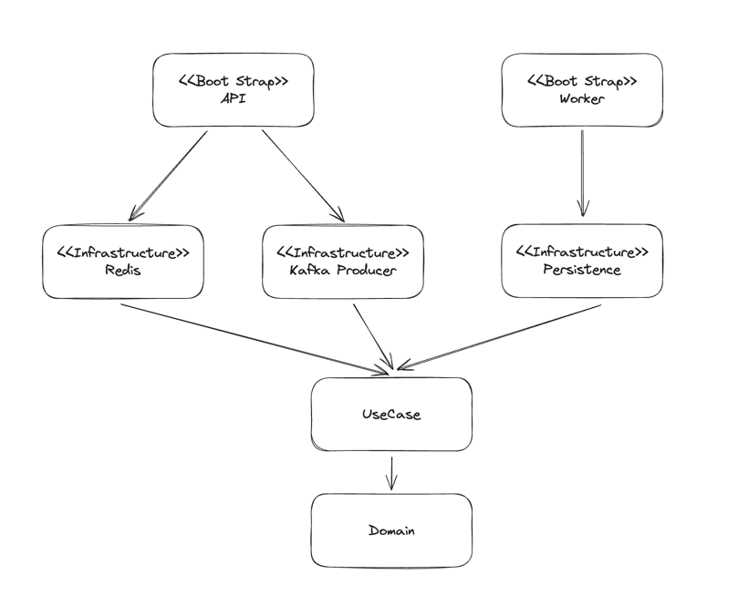

# 멀티 모듈 헥사고날 아키텍처로 선착순 쿠폰시스템 만들기



선착순 쿠폰 시스템을 만드는 과정에서, Producer와 Consumer를 분리해 서버를 설계하면서 도메인을 중복으로 작성하게 되어 관리포인트가 늘어난다는 느낌을 받았습니다. 이를 해결하기 위해 헥사고날 아키텍처를 적용해 도메인 모듈을 따로 분리하고 하나의 도메인 의존성을 Producer모듈과 Consumer모듈에서 의존하게 하여 도메인 관리포인트를 하나로 줄이는 방식으로 설계해 보았습니다.

## 헥사고날 아키텍처

헥사고날 아키텍처는 계층형 아키텍처의 대안으로 Alistair Cockburn에 의해 고안되었습니다. 기존 계층형 아케텍처의 경우 모든 계층이 영속성 계층을 토대로 만들어 지기 때문에 비즈니스 로직의 변경이 어렵고, 테스트 또한 영속성 컴포넌트에 의존성이 생기기 때문에 테스트의 복잡도의 높이는 등 여러 문제점이 존재합니다.

> 업무규칙은 사용자 인터페이스나 데이터베이스와 같은 저수준의 관심사로 인해 오염되어서는 안되며, 원래 그대로의 모습으로 남아 있어야 한다. 이상적으로는 업무 규칙을 표현하는 코드는 반드시 시스템의 심장부에 위치해야 하며, 덜 중요한 코드는 이 심장부에 플러그인 되어야 한다. 업무 규칙은 시스템에서 가장 독립적이며 가장 많이 재사용할 수 있는 코드여야 한다. - 로버트 C. 마틴, 클린 아키텍처


헥사고날 아키텍처는 이러한 문제점을 의존역전을 통에 의존성이 도메인을 향하게 하면서 이러한 문제를 해결합니다. 애플리케이션의 핵심 로직을 외부 시스템으로 부터 격리시켜 외부 요소의 변화에 의해 핵심 로직이 영향을 받지 않도록 합니다. 이를 통해 핵심 로직을 테스트하기 쉽고, 변경하기 쉽게 만듭니다.


헥사고날 아키텍처는 포트(Port)와 어댑터(Adapter) 아키텍처라고도 불리며, 포트와 어댑터는 다음과 같은 특징을 가지고 있습니다.

### 포트 (Port)
포트는 애플리케이션의 핵심 로직과 외부 세계 사이의 인터페이스 역할을 합니다.

**Primary/Driving Ports**
외부 시스템(예: 사용자 인터페이스, 웹 요청 등)으로부터 애플리케이션의 핵심 로직으로의 데이터 흐름을 다룹니다. 외부 요소들은 외부 포트를 통해 애플리케이션의 핵심 기능을 활용하게 됩니다.

**Secondary/Driven Ports** 

애플리케이션 핵심 로직으로부터 외부 시스템이나 인프라스트럭처(예: Database, Message Queue, 외부 API)로의 데이터 흐름을 다룹니다. 애플리케이션은 Secondary Port를 통해 외부 자원을 필요로 할 때 접근합니다.

### 어댑터 (Adapter)
어댑터는 포트와 외부 세계 사이에서 데이터 형식을 변환하고, 호출을 중개하는 역할을 합니다. 포트와 외부 시스템 간의 중간자로서, 서로 다른 시스템 간의 통신을 가능하게 합니다.

**Primary/Driving Adapters**
애플리케이션의 핵심 로직에 접근하는 외부 시스템(예: 웹 서버, GUI 클라이언트 등)을 다룹니다. 외부 요청을 애플리케이션의 포트에 맞는 형식으로 변환합니다.

**Secondary/Driven Adapters**
애플리케이션에서 필요한 외부 자원(예: 데이터베이스, 파일 시스템, 외부 API 등)을 다룹니다. 핵심 로직의 요청을 외부 자원에 맞는 형식으로 변환합니다.


## 쿠폰 시스템 멀티모듈 구성



앞서 설명한 헥사고날 아키텍처의 각 레이어를 차용하여 모듈을 설계하였습니다.

## Domain

애플리케이션의 핵심 로직을 담당하는 모듈로, 도메인을 정의하고 있습니다. 외부 시스템에 의존하지 않도록 POJO로 구현되어 있습니다.


## Use Case

도메인에 대한 Use Case를 정의하는 모듈입니다.

## DB 채번을 줄이기 위해 Ulid 사용하기

보통 JPA를 사용하면 Primary Key를 `@GeneratedValue` 어노테이션을 통해 자동으로 생성합니다. 이런 전략을 사용하면 데이터베이스에서 자동으로 채번을 해주기 때문에 개발자는 신경쓰지 않아도 됩니다. 하지만 이런 전략은 데이터 베이스에 대한 채번을 유발하며, 영속화 되기 전까진 id값을 null로 유지해야한다는, 다소 데이터 베이스에 의존적으로 코드를 작성하게 되는 단점이 있습니다.

이런 단점을 해결하기 위해 UUID를 사용하는 방법이 있습니다. UUID는 데이터베이스에 의존적이지 않고, 영속화 되기 전까지 id값을 null로 유지할 필요가 없습니다. 하지만 UUID는 생성 순서를 보장하지 않기 때문에 목록 조회 시 정렬기준으로 삼기에는 적합하지 않아 성능적인 이점을 가져갈 수 없습니다. 

이때 ULID를 활용할 수 있습니다. ULID는 UUID와 호환성을 가지면서 시간순으로 정렬할 수 있는 특징을 가지고 있습니다. 물론 ULID도단점이 있습니다. UUID가 나노초까지 시간순을 보장해주는 반면 ULID는 밀리초까지만 시간순을 보장해줍니다. 이를 보완하기위해 ULID Creator 라이브러리는 Monotonic ULID를 제공합니다. Monotonic ULID는 동일한 밀리초가 있다면 다음에 생성되는 ULID의 밀리초를 1 증가시켜서 생성하여 앞서 말한 단점을 보완합니다.  

DB에 Primary Key를 채번하지 않고 도메인에서 직접 생성해서 사용하는 이러한 방식이 도메인이 외부에 의존하지 않고 직접 식별자를 생성할 수 있어서 클린 아키텍처에서는 더 큰 장점으로 느껴졌습니다. 

```kotlin

```

## 카프카를 사용하는 이유

선착순 이벤트의 경우 수많은 유저가 동시에 요청을 보내게 됩니다. 이때 API Server 에서 DB에 쿠폰 row를 생성하는 작업을 직접 처리를 한다면 DB에 부하가 몰리게 되어 다른 요청을 처리할 수 없는 상태가 됩니다. 

이러한 문제점을 해결하기 위해 API서버가 직접 DB에 생성을 요청하는 대신 쿠폰 생성 이벤트를 발행해 카프카에 전달하고 이벤트를 작업 서버가 전달받아 DB에 쿠폰 row를 생성하게 할 수 있습니다. 이렇게 하면 API 서버는 DB에 직접 접근하지 않고 카프카에 이벤트를 발행하고 응답을 전달하는 역할만 하게 되어 API 서버의 부하를 줄일 수 있을 뿐더러 작업서버는 카프카에 발행된 이벤트를 순차적으로 처리하기 때문에 DB에 동시에 부하가 몰리는 것을 방지할 수 있습니다.

Kafka 는 토픽에 있는 데이터를 순차적으로 가져와서 처리하게 됩니다.
Consumer 가 1개가 있고 토픽에 데이터가 100개가 있다고 가정할때 Consumer 에서는 1번 데이터를 가져와서 처리가완료되면 2번 데이터를 가져와서 처리합니다.


## Reference

- [Hexagonal architecture - alistair](https://alistair.cockburn.us/hexagonal-architecture/)
- [DDD, Hexagonal, Onion, Clean, CQRS, … How I put it all together
  ](https://herbertograca.com/2017/11/16/explicit-architecture-01-ddd-hexagonal-onion-clean-cqrs-how-i-put-it-all-together/)
- 만들면서 배우는 클린 아키텍처 - 톰 홈버그 지음, 박소은 옮김
- Clean Architecture: A Craftsman's Guide to Software Structure and Design (Robert C. Martin Series) 1st Edition
- [우아한기술블로그 - Spring Boot Kotlin Multi Module로 구성해보는 헥사고날 아키텍처
  ](https://techblog.woowahan.com/12720/)
- [Spoqa 기술 블로그 - 스포카에서 Kotlin으로 JPA Entity를 정의하는 방법](https://spoqa.github.io/2022/08/16/kotlin-jpa-entity.html)
- [Line engineering - 지속 가능한 소프트웨어 설계 패턴: 포트와 어댑터 아키텍처 적용하기
  ](https://engineering.linecorp.com/ko/blog/port-and-adapter-architecture)
- [인프런 - 실습으로 배우는 선착순 이벤트 시스템](https://www.inflearn.com/course/%EC%84%A0%EC%B0%A9%EC%88%9C-%EC%9D%B4%EB%B2%A4%ED%8A%B8-%EC%8B%9C%EC%8A%A4%ED%85%9C-%EC%8B%A4%EC%8A%B5)
