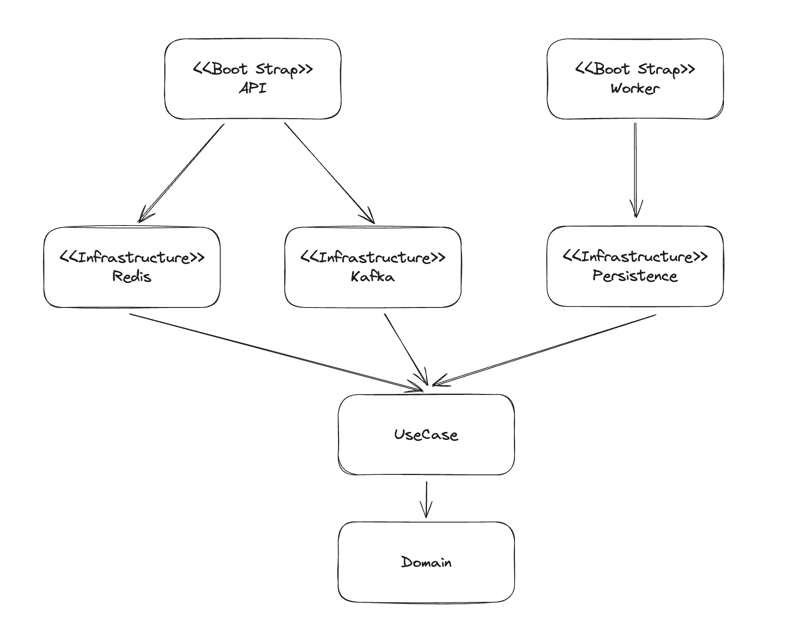
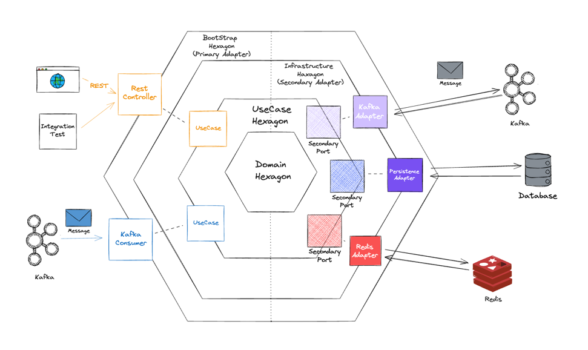

# 멀티 모듈 헥사고날 아키텍처로 선착순 쿠폰시스템 만들기

- 헥사고날 아키텍처와 멀티모듈에 대해서 다룹니다.
- 헥사고날 아키텍처를 적용하면서 구현에 미친 영향에 대해서 다룹니다.
  - Component Scan의 패키지 범위설정 
  - Component Scan의 LazyInit 옵션
  - application.yaml 파일의 include


선착순 쿠폰 시스템을 만드는 과정에서, Producer와 Consumer를 분리해 서버를 설계하면서 도메인을 중복으로 작성하게 되어 관리포인트가 늘어난다는 느낌을 받았습니다. 이를 해결하기 위해 헥사고날 아키텍처를 활용해 도메인 모듈을 따로 분리하고 하나의 도메인 의존성을 Producer모듈과 Consumer모듈에서 의존하게 하여 도메인 관리포인트를 하나로 줄이는 방식으로 설계해 보았습니다.

## 헥사고날 아키텍처

헥사고날 아키텍처는 계층형 아키텍처의 대안으로 Alistair Cockburn에 의해 고안되었습니다. 기존 계층형 아키텍처의 경우 모든 계층이 영속성 계층을 토대로 만들어 지기 때문에 비즈니스 로직의 변경이 어렵고, 테스트 또한 영속성 컴포넌트에 의존성이 생기기 때문에 테스트의 복잡도의 높이는 등 여러 문제점이 존재합니다.

> 업무규칙은 사용자 인터페이스나 데이터베이스와 같은 저수준의 관심사로 인해 오염되어서는 안되며, 원래 그대로의 모습으로 남아 있어야 한다. 이상적으로는 업무 규칙을 표현하는 코드는 반드시 시스템의 심장부에 위치해야 하며, 덜 중요한 코드는 이 심장부에 플러그인 되어야 한다. 업무 규칙은 시스템에서 가장 독립적이며 가장 많이 재사용할 수 있는 코드여야 한다. - 로버트 C. 마틴, 클린 아키텍처


헥사고날 아키텍처는 이러한 문제점을 의존역전을 통에 의존성이 도메인을 향하게 하면서 이러한 문제를 해결합니다. 애플리케이션의 핵심 로직을 외부 시스템으로 부터 격리시켜 외부 요소의 변화에 의해 핵심 로직이 영향을 받지 않도록 합니다. 이를 통해 핵심 로직을 테스트하기 쉽고, 변경하기 쉽게 만듭니다.


헥사고날 아키텍처는 포트(Port)와 어댑터(Adapter) 아키텍처라고도 불리며, 포트와 어댑터는 다음과 같은 특징을 가지고 있습니다.

### 포트 (Port)
포트는 애플리케이션의 핵심 로직과 외부 세계 사이의 인터페이스 역할을 합니다.

**Primary/Driving Ports**

외부 시스템(예: 사용자 인터페이스, 웹 요청 등)으로부터 애플리케이션의 핵심 로직으로의 데이터 흐름을 다룹니다. 외부 요소들은 외부 포트를 통해 애플리케이션의 핵심 기능을 활용하게 됩니다.

**Secondary/Driven Ports** 

애플리케이션 핵심 로직으로부터 외부 시스템이나 인프라스트럭처(예: Database, Message Queue, 외부 API)로의 데이터 흐름을 다룹니다. 애플리케이션은 Secondary Port를 통해 외부 자원을 필요로 할 때 접근합니다.

### 어댑터 (Adapter)
어댑터는 포트와 외부 세계 사이에서 데이터 형식을 변환하고, 호출을 중개하는 역할을 합니다. 포트와 외부 시스템 간의 중간자로서, 서로 다른 시스템 간의 통신을 가능하게 합니다.

**Primary/Driving Adapters**

애플리케이션의 핵심 로직에 접근하는 외부 시스템(예: 웹 서버, GUI 클라이언트 등)을 다룹니다. 외부 요청을 애플리케이션의 포트에 맞는 형식으로 변환합니다.

**Secondary/Driven Adapters**

애플리케이션에서 필요한 외부 자원(예: 데이터베이스, 파일 시스템, 외부 API 등)을 다룹니다. 핵심 로직의 요청을 외부 자원에 맞는 형식으로 변환합니다.


## 쿠폰 시스템 멀티모듈 구성




앞서 설명한 헥사고날 아키텍처의 각 레이어를 차용하여 모듈을 설계하였습니다.

### Domain Hexagon

애플리케이션의 핵심 로직을 담당하는 모듈로, 도메인을 정의하고 있습니다. 
- POJO로 구현되어 있습니다.
- common 모듈내 라이브러리 외 의존성을 가지지 않습니다.

도메인 모델을 정의하는 모듈이므로, Domain Hexagon으로 명명하였습니다.

### Use Case Hexagon

도메인에 대한 Use Case를 정의하는 모듈입니다.
- 외부 시스템과의 통신을 위한 Port 인터페이스를 정의합니다.
- Domain 외 Spring Boot, Common 모듈내 라이브러리 의존성을 가집니다.

도메인에 대한 유스케이스를 정의하는 모듈이므로, UseCase Hexagon으로 명명하였습니다.

### Infrastructure Hexagon

- 외부 인프라와의 통신을 위한 Secondary Adapter를 정의합니다.
  - Kafka Producer Adapter, Persistence Adapter, Redis Adapter 등
- Domain, Use Case 외 Spring Boot, Common 모듈내 라이브러리 의존성을 가집니다.
- 외부 인프라별로 Module을 분리해 관리합니다
  - coupon-infrastructure/kafka
  - coupon-infrastructure/persistence
  - coupon-infrastructure/redis
- 각 모듈별로 config class를 정의하며, application-{module name}.yaml 파일을 통해 각 모듈별로 설정을 관리합니다.
  - application-kafka.yaml
  - application-persistence.yaml
  - application-redis.yaml

외부 인프라에대한 의존성을 정의하는 모듈이므로, Infrastructure Hexagon으로 명명하였습니다.

### Bootstrap Hexagon

- 외부 요청을 받아 Use Case를 실행하기 위한 Primary Adapter를 정의합니다.
  - RestController, Kafka Consumer 등
- Domain, Use Case, Infrastructure 외 Spring Boot, Common 모듈내 라이브러리 의존성을 가집니다.
- Spring Boot Application을 정의합니다.
- UseCase Hexagon과 Infrastructure Hexagon을 의존합니다.

여러 의존성을 조합해 하나의 애플리케이션 서버를 구성하는 모듈이므로 Bootstrap Hexagon으로 명명하였습니다.

Infrastructure 모듈과 같이 애플리케이션이 제공할 각 서비스별로 Module을 분리해 제공하는 방법도 고려해보았지만, 애플리케이션 서버마다 제공하는 API가 서로 다른경우가 훨씬 많기 때문에 모듈분리의 효용성이 떨어진다고 판단하여 Bootstrap 모듈에 Primary Adapter를 정의하였습니다.


## 헥사고날 아키텍처를 적용하면서 구현에 미친 영향

### Component Scan에 Lazy 옵션을 적용하기

UseCase 모듈의 UseCaseConfig
```kotlin
@Configuration
@ComponentScan(basePackages = ["com.waterfogsw.coupon.usecase"], lazyInit = true)
class UseCaseConfig
```

UseCase 모듈은 API Server, Worker Server모두 공통적으로 의존하는 모듈입니다. 

하지만, API서버의 경우 Persistence모듈 의존성이 존재하지 않아, 쿠폰을 생성하고 DB에 저장하는 CreateCouponUseCase를 컴포넌트 스캔으로 등록하면 에러가 발생합니다. 마찬가지로 Worker 서버의 경우 Redis 모듈 의존성이 존재하기 않기 때문에 발행된 쿠폰의 개수를 Redis에서 조회하고 발행 이벤트를 Kafka에 전달하는 IssueCouponUseCase 를 컴포넌트 스캔으로 등록하면 에러가 발생합니다.

이러한 문제를 해결하기 위해 Usecase 모듈의 ComponentScan에 lazyInit 속성을 true로두어, UseCase를 사용하는 시점에 Bean을 생성하도록 하였습니다. 이렇게 하면 API서버는 CreateCouponUseCase에 의존성을 갖는 클래스가 존재하지 않기때문에 CreateCouponUseCase를 빈으로 등록하지 않습니다. 마찬가지로 Worker 서버는 IssueCouponUseCase를 의존성을 갖는 클래스가 존재하지 않아 IssueCouponUseCase를 빈으로 등록하지 않습니다.

Component Scan을 각 모듈내에서 수행되도록 하기위해서 각 모듈의 ComponentScan어노테이션의 패키지 위치를 잘 지정해 주어야 합니다. 

`@SpringBootApplication`어노테이션이 `@ComponentScan`어노테이션을 내장하고 있기 때문에 위치를 잘 지정해 두어야 합니다. 예를들어 `@SpringBootApplication`어노테이션이있는 Application 클래스를 `com.waterfogsw.coupon` 패키지에 위치시키면, 다른 모듈에 있는 클래스라 하더라도 `com.waterfogsw.coupon.*` 패키지 하위의 모든 클래스들은 컴포넌트 스캔의 대상이 되기 때문에 의도치 않은 빈이 등록될 수 있습니다.

### 모듈별 Config, application.yaml

```kotlin
@Configuration
@Import(
  value = [
    KafkaProducerConfig::class,
    RedisConfig::class,
    UseCaseConfig::class
  ]
)
class ApiConfig 
```

```kotlin
@Configuration
@Import(
    PersistenceConfig::class,
    UseCaseConfig::class,
)
class WorkerConfig
```


위와 같이 각 모듈별로 Config 클래스를 정의하고, BootStrap Hexagon에 위치하는 API, Worker모듈의 Config는 각 모듈이 의존하고있는 모듈의 Config를 Import하도록 구현하였습니다.  


또한 application-{module name}.yaml 파일을 통해 각 모듈별로 설정을 관리하기 때문에 API 모듈과 Worker 모듈의 application.yaml 파일은 다음과 같이 각 하위 의존성의 application.yaml을 include하도록 구현하였습니다.

**API 모듈의 application.yaml**
```yaml
server:
  port: 8080
  shutdown: graceful
spring:
  profiles:
    active: local
    include:
      - kafka
      - redis
      - usecase
```

**Worker 모듈의 application.yaml**
```yaml
server:
  port: 8081
  shutdown: graceful
spring:
  profiles:
    active: local
    include:
      - persistence
      - usecase
```

### DB 채번을 줄이기 위해 Ulid 사용하기

보통 JPA를 사용하면 Primary Key를 `@GeneratedValue` 어노테이션을 통해 자동으로 생성합니다. 이런 전략을 사용하면 데이터베이스에서 자동으로 채번을 해주기 때문에 개발자는 신경쓰지 않아도 됩니다. 하지만 이런 전략은 데이터 베이스에 대한 채번을 유발하며, 영속화 되기 전까진 id값을 null로 유지해야한다는, 다소 데이터 베이스에 의존적으로 코드를 작성하게 되는 단점이 있습니다.

이런 단점을 해결하기 위해 UUID를 사용하는 방법이 있습니다. UUID는 데이터베이스에 의존적이지 않고, 영속화 되기 전까지 id값을 null로 유지할 필요가 없습니다. 하지만 UUID는 생성 순서를 보장하지 않기 때문에 목록 조회 시 정렬기준으로 삼기에는 적합하지 않아 성능적인 이점을 가져갈 수 없습니다. 

이때 ULID를 활용할 수 있습니다. ULID는 UUID와 호환성을 가지면서 시간순으로 정렬할 수 있는 특징을 가지고 있습니다. 물론 ULID도단점이 있습니다. UUID가 나노초까지 시간순을 보장해주는 반면 ULID는 밀리초까지만 시간순을 보장해줍니다. 이를 보완하기위해 ULID Creator 라이브러리는 Monotonic ULID를 제공합니다. Monotonic ULID는 동일한 밀리초가 있다면 다음에 생성되는 ULID의 밀리초를 1 증가시켜서 생성하여 앞서 말한 단점을 보완합니다.  

DB에 Primary Key를 채번하지 않고 도메인에서 직접 생성해서 사용하는 이러한 방식이 **도메인이 외부에 의존하지 않고 직접 식별자를 생성할 수 있어서 클린 아키텍처에서는 더 큰 장점으로 느껴졌습니다.**


## 부록

### 카프카를 사용하는 이유

선착순 이벤트의 경우 수많은 유저가 동시에 요청을 보내게 됩니다. 이때 API Server 에서 DB에 쿠폰 row를 생성하는 작업을 직접 처리를 한다면 DB에 부하가 몰리게 되어 다른 요청을 처리할 수 없는 상태가 됩니다. 

이러한 문제점을 해결하기 위해 API서버가 직접 DB에 생성을 요청하는 대신 쿠폰 생성 이벤트를 발행해 카프카에 전달하고 이벤트를 작업 서버가 전달받아 DB에 쿠폰 row를 생성하게 합니다. 

API 서버는 DB에 직접 접근하지 않고 카프카에 이벤트를 발행하고 응답을 전달하는 역할만 하게 되어 API 서버의 부하를 줄일 수 있으며, 작업서버는 카프카에 발행된 이벤트를 순차적으로 처리하기 때문에 DB에 동시에 부하가 몰리는 것을 방지할 수 있습니다.

### Reference

- [Hexagonal architecture - alistair](https://alistair.cockburn.us/hexagonal-architecture/)
- [DDD, Hexagonal, Onion, Clean, CQRS, … How I put it all together
  ](https://herbertograca.com/2017/11/16/explicit-architecture-01-ddd-hexagonal-onion-clean-cqrs-how-i-put-it-all-together/)
- 만들면서 배우는 클린 아키텍처 - 톰 홈버그 지음, 박소은 옮김
- Clean Architecture: A Craftsman's Guide to Software Structure and Design (Robert C. Martin Series) 1st Edition
- [우아한기술블로그 - Spring Boot Kotlin Multi Module로 구성해보는 헥사고날 아키텍처
  ](https://techblog.woowahan.com/12720/)
- [Spoqa 기술 블로그 - 스포카에서 Kotlin으로 JPA Entity를 정의하는 방법](https://spoqa.github.io/2022/08/16/kotlin-jpa-entity.html)
- [Line engineering - 지속 가능한 소프트웨어 설계 패턴: 포트와 어댑터 아키텍처 적용하기
  ](https://engineering.linecorp.com/ko/blog/port-and-adapter-architecture)
- [인프런 - 실습으로 배우는 선착순 이벤트 시스템](https://www.inflearn.com/course/%EC%84%A0%EC%B0%A9%EC%88%9C-%EC%9D%B4%EB%B2%A4%ED%8A%B8-%EC%8B%9C%EC%8A%A4%ED%85%9C-%EC%8B%A4%EC%8A%B5)
